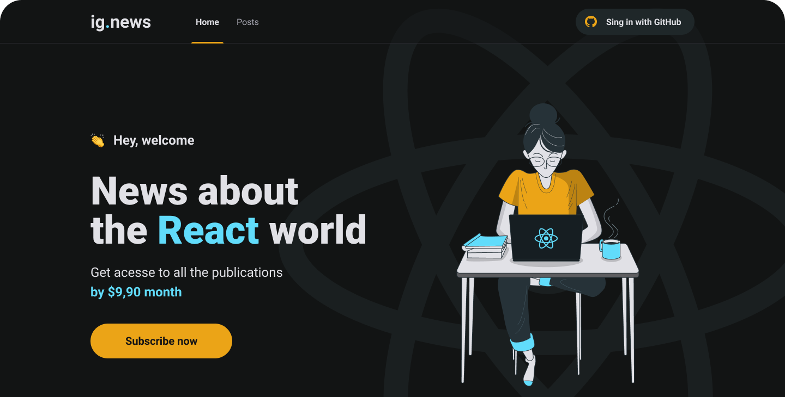

# 😎 Ignews

<h1 align="center">
  
</h1>

## ❔ Sobre

Projeto criado no curso da Rocketseat! Consiste em um blog de notícias pago, onde o usuário não assinante visualiza parte do conteúdo, e o assinante consegue visualizar todo o conteúdo, além de atutenticação realizada com o github.

## 🛠 Tecnlogias usadas

- NextJs
- FaunaDB
- Stripe
- Prismic

## 🚀 Como rodar

